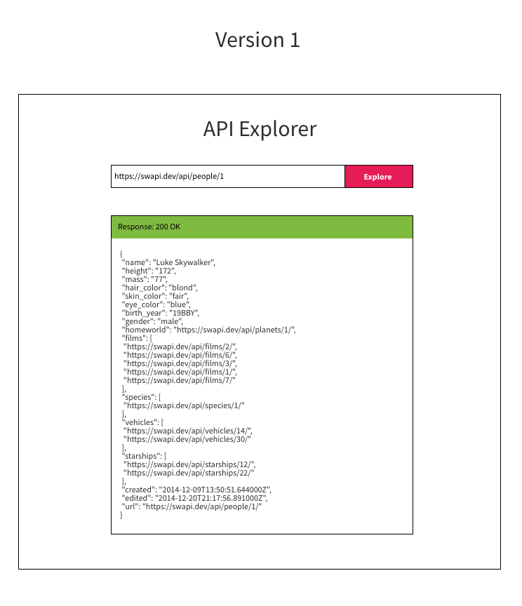

# Vanilla JavaScript

## What is "Vanilla" JavaScript

Basics (always part of javascript)

- Basics: map, find, filter, reduce, if, var
- Write everything yourself (no framework or libries)
- Frontend JavaScript (frontend), NodeJS (backend)
- DOM -> Document Object Model

## Usecases

No unnecessary JavaScript

- You do not want to rely on any dependencies
- Optimize the size of your the code you send
- 3rd party -> integrate a little script on someone site
- Simplify (do some simple things like an animation)
- You are using a server framework that does most of the heavy lifting (Ruby on Rails, .NET C#), Not building a SPA
- You want to combine a little vanilla with a JS framework you are using

When to avoid Vanilla JavaScript

- A framework is already being used -> use the framework
- You are building a complex app (will be become hard to maintain)
- It costs a lot of time to do JavaScript

Balance: Dev time & Run time

## Differences with React

React

- data -> render the components
- user action -> change the underlying data -> rerender the components (react does this for you)

```js
const [show, setShow] = useState(false);

return (
  <div>
    <button onClick={() => setShow(true)}>Click me</button>
    {show === true ? "I am Visable" : null}
  </div>
);
```

Vanilla

- data is stored in the HTML itself, instead of state or props
- If you want to page:
- select the element you want to change -> change it
- Direct manipulation of the page, not the underlying data
- State is kept in the HTML elements

```js
const element = document.getElementById("somethingHidden");

element.style.display = "none";

function show() {
  element.style.display = "block";
}

<button onClick="show()"></button>;
```

## Common strategies & DOM Methods

- Select element(s) on the page -> manipulate them by reassigning property

```html
<html>
  <h1 id="somethingToBeRemoved">I am visable</h1>
</html>
```

```javascript
const element = document.getElementById("somethingToBeRemoved");
element.style.display = "block";
```

- Select element(s) on the page -> call some method on the element

```javascript
const element = document.getElementById("somethingToBeRemoved");
element.remove();
```

- Create new Elements and put them on the page

```javascript
const list = document.getElementById("myList");

// add a new item to the list

// creating the item
const listItem = document.createElement("li");
// setting the content of the item
li.innerText = "I need to explain Vanilla";

// put it on the page
list.appendChild(listItem);
```

- Adding event listeners to elements

```javascript
const button = document.getElementById("myButton");

button.addEventListener("click", (event) => {
  button.style.color = "red";
  // now the button text is red
});
```

## Making a simple app

Todo List

- [x] As a user I want to see the things I have to do
- [x] As a user I want to check items on my todoList
  - Linethrough when checked
  - [x] Onclick -> added event listener to each checkbox
  - [x] Some way of selecting the item we want to change (parentElement)
  - [x] Change the style of the todoitem
- As a user I want to clear any items on my list that are done
  - [x] a button
  - [x] event listener on the button
  - [x] event handler
  - [x] select items which items are done
  - [x] remove them
- As a user I want to add new todo items to my list
  - [x] input field
  - [x] button
  - [x] event listener
  - [x] event handler
  - [x] get the value of the inputfield
  - [x] add new item to the list
    - createElement
    - appendChild (add the element we created to the list)

## Exercise - build vanilla JS api explorer

See design



- User puts in a url -> click "Explore"
- Print out the JSON and the status code

- How to make request with vanilla javascript
- window.fetch() ->

Hint 1:

```javascript
async function getUserAsync(name) {
  let response = await fetch(`https://api.github.com/users/${name}`);
  let data = await response.json();

  // put elements on the page, select, change properties, create elements
}
```

Hint 2:

If you want to format JSON, consider using

- a `<pre>` element
- JSON.stringify({ hello: 'hello'}, null, 4)

## Day 2

- Investigate: Why does my clear button not clear all the items :(
- Some more "modern" vanilla methods
  - document.querySelector() / document.querySelectorAll() -> css selector, and use forEach
  -
- The idea of initializing our JavaScript (where to put our script)
- What is the DOM actually??
- V2 api explorer

Diagnosis

- [x] Does my function run? -> put in a log
- [x] Go line by line, verify that each line works as intended

  - Make a log with the output of a piece of code
  - Make predictions of what you are going to see -> test your understanding, you might not spot the bug otherwise
  - Verify your prediction was correct (run the code)

- Problem: length of the collection was getting changed halfway through the loop
